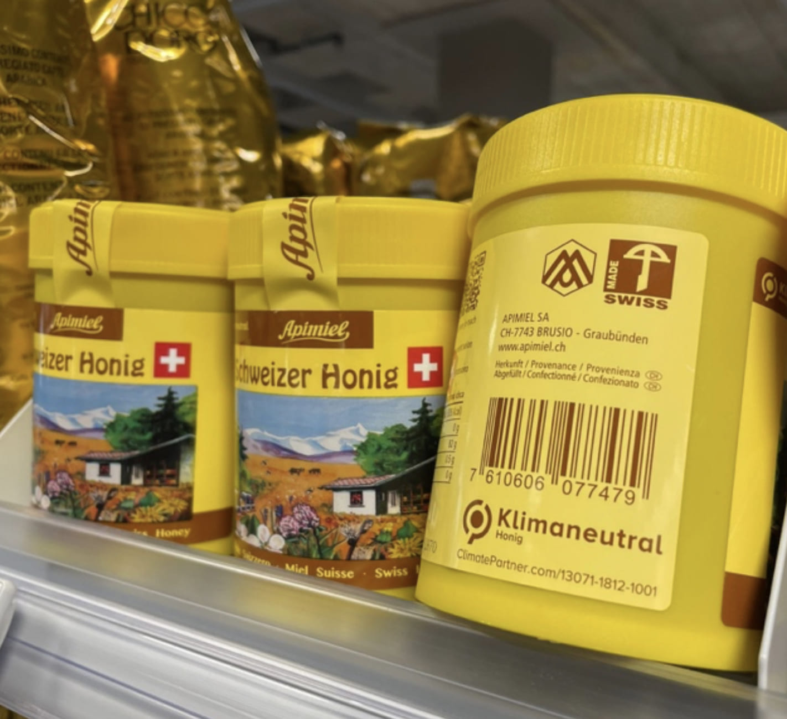
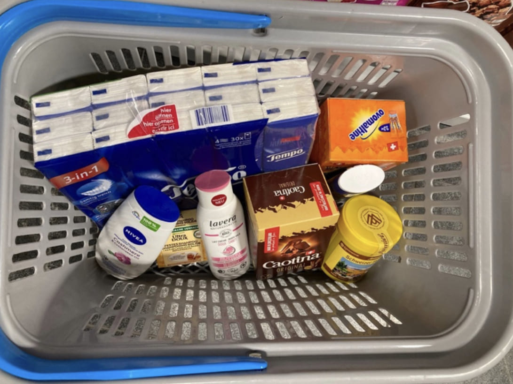

+++
title = "CO2- Kompensation, die Lösung für den Klimawandel?"
date = "2023-06-01"
draft = false
pinned = false
tags = ["deutschreportage"]
image = "31dbe7da-a953-412e-ad94-af872e7ac2c4-2.jpg"
description = "In Supermärkten sieht Lina immer mehr Labels, die Klimaneutralität versprechen, jedoch tendiert sie immer wieder dazu, nach den günstigeren Angeboten zu greifen. Sollte sie sich dafür schuldig fühlen? Oder sind diese klimaneutralen Labels doch gar nicht so grün, wie sie versprechen, und schaden sie vielleicht sogar der Umwelt?"
+++
### Klimaneutralität, wie?

"Klimaneutral"- dieses Label soll zeigen, dass sich ein Unternehmen mit seinem CO2- Fussabdruck befasst und bereit ist, diesen zu verkleinern und nach nachhaltigen Lösungen zu suchen. Eigentlich eine gute Idee, doch dahinter steckt eine ganze Wirtschaft, die von diesen Versprechen lebt.

Stell dir vor, du hast ein Unternehmen und dein Ziel ist es, bis ins Jahr 2040 Netto-Null zu erreichen. Du schaffst das aber nicht von heute auf morgen. Du kannst zwar grünere Rohstoffe einkaufen und andere Verpackungen brauchen und trotzdem wird im ganzen Herstellungsprozess und in der Transportkette noch sehr viel CO2 ausgestossen. In diesen beiden Bereichen ist es sehr viel schwieriger, klimaneutral zu werden, und oftmals ist es mit sehr viel Geld und Aufwand verbunden. Hier kommt die CO2-Kompensation ins Spiel. Meist ist es für ein Unternehmen einfacher, das Geld, das für die Veränderungen aufgewendet werden müsste, in CO2- Kompensation zu investieren. Doch das Problem ist nicht gelöst, die Unternehmen schieben so den Aufwand zeitlich nur auf oder sogar ganz weg.

### Was genau ist diese CO2-Kompensation und wie funktioniert sie?

Dein Unternehmen hat jetzt die Möglichkeit, einer spezialisierten Firma (in unserem Bespiel ClimatePartner) Geld zu zahlen, damit diese den CO2-Fussabdruck deines Unternehmens berechnet. Sie zeigt dir diverse Strategien auf, wie du dem Ziel Netto-Null näherkommen kannst. Wir haben mit Lorena Huber, die Sustainability Consultant von ClimatePartner, ein Interview über Teams geführt. Die professionell wirkende junge Frau sitzt passend zu unserem Thema vor einem Bild eines grünen Regenwaldes und dem Logo von ClimatePartner. So berichtet sie uns: «ClimatePartner ist eine Rundumlösung. Im besten Fall für Kunden, die sich effektiv für Klimaschutz interessieren, das heisst für Kunden die wirklich eine Klimaschutzstrategie aufbauen möchten, die vielleicht noch keine Vorstellungen haben, wie man Klimaschutz im Unternehmen umsetzen kann.» Der Rest der Emissionen, der nicht durch diese Strategien eingespart werden kann, wird dann durch CO2 Zertifikate kompensiert. Frau Huber erklärt uns, dass es bei ClimatePartner so sei, dass die Firma mit ihren Kunden nach nachhaltigen und langfristigen Lösungen suche, damit eines Tages der Kunde gar keine Emissionen mehr verursache. An dieser Stelle würde man dann von Netto-Null sprechen.

### Umstrittene Kompensation

Klingt noch vernünftig, oder?

Jedoch ist das Ganze nicht so einfach. Ein Problem ist, dass es keinen weltweit verbreiteten Standard für die Berechnung der Emissionen eines Unternehmens gibt. Firmen wie ClimatePartner haben einen firmeninternen Algorithmus, der nicht für die Öffentlichkeit einsehbar ist, der Prognosen für den CO2-Austoss des Kunden berechnet. Diese Berechnungen sind bei vielen Firmen zu hoch angesetzt, und somit übertrieben und unrealistisch. Dadurch wirkt der Einsatz für den Umweltschutz der Firma beeindruckender. Man muss sich die Frage stellen, ob dieser Ausstoss an CO2 wirklich so hoch ist, oder ob die Firmen mit ihrer Verkaufsstrategie nur auf den Profit aus sind.

Zwei Reporterinnen der deutschen Zeitung “Die Zeit”i haben sich eine Start-up Firma ausgedacht, und dann bei myclimate probiert, ein «klimaneutraler Betrieb» zu werden. Im Prozess haben sie extra unrealistisch niedrige Zahlen angegeben. Bei der Vergabe des Labels hat das niemand hinterfragt.

Auf Nachfrage der Journalistinnen, schrieb myclimate, dass es gar nicht möglich sei, alles zu überprüfen, und dass sie deshalb den Unternehmen ein Vertrauensvorschuss gegeben müssen. Ausserdem wird aus der Recherche der beiden klar, wie wenig es eigentlich kostet die errechneten 6,4 Tonnen CO2 zu kompensieren. So halten sie in dem am 8. September 2022 erschienen Artikel folgendes fest:

> *«Schließlich sollen wir 571 Euro zahlen. Die Einzelposten auf der Rechnung sind bemerkenswert: 422,65 Euro verlangt myclimate dafür, dass wir das Label nutzen dürfen. Nur 149 Euro fließen in das Klimaprojekt, um tatsächlich CO2 einzusparen.»*
>
> *— “Die Zeit“* 

Es gibt Prüfungssiegel, aus welchen die Firmen auswählen können, welches zu ihnen passt. Die Prüfungssiegel sind private Unternehmen, die ihr Geld damit verdienen, indem sie die Firmen "prüfen".
So schrieb die NZZ in einem Artikel vom 14.03.2023ii: «Doch jüngste Enthüllungen könnten dem boomenden Geschäft mit den Klimakompensationen nun einen harten Schlag versetzen. Auslöser ist eine Ende Januar publizierte Recherche der deutschen «Zeit», des britischen «Guardian» und des Reporterpools «Source Material».
Sie kam zum Schluss, dass hinter mehr als 90 Prozent der CO2-Zertifikate, die der Marktführer Verra basierend auf Projekten zum Schutz von Regenwäldern ausgegeben hatte, keine realen Emissionsminderungen stehen. Damit gelangten Millionen von Zertifikaten in den Verkauf, die es nie hätte geben dürfen.»

«Wenn man es richtig machen würde, wäre es eine gute Idee,», meint Lina, eine treue Migros und Coop Kundin, «ich bin jedoch eher skeptisch und vertraue dem ganzen eher nicht.» Damit ist sie nicht allein, denn etwa 36 Prozent der Schweizer Kunden sind ihrer Meinung.

Auch ClimatePartner ist von diesen neusten Enthüllungen betroffen, jedoch sei man daran mit Experten zu prüfen wie stark, und wie man weiterfahren wolle, berichtet uns Frau Huber.

Dieser Artikel zeigt, wie undurchsichtig dieses Geschäft ist. Firmen, die unredlich wirtschaften, können also nicht von den ehrlichen unterschieden werden und schaden somit der ganzen Branche.

Ausserdem beinhalten Messungen oft nicht alle externen Faktoren, die wiederum umweltschädlich oder sozial unverträglich sein können. Eine klimaneutrale Schokoladentafel; zum Beispiel - sie hat zwar einen geringen Fussabdruck, aber was ist mit den Bauern, die die Kakaobohnen unter schlechten Arbeitsbedingungen angebaut haben?

### Die verschiedenen Arten von Klimaschutzprojekte

Nachdem sich dein Unternehmen mit seinem Fussabdruck befasst hat und seine Emissionen nach und nach durch innovative Lösungen zu senken beginnt, werden die restlichen Emissionen durch Klimaschutzprojekte kompensiert.
Es gibt verschiedene Kategorien von Klimaschutzprojekten:

«Kaufe ein Produkt, pflanze einen Baum». Solche Strategien sind sehr beliebt, jedoch meistens nutzlos, wie uns Frau Huber von ClimatePartner erklärt. Diese Projekte sind nicht sehr nachhaltig und effizient. Meist werden einfach Monokulturen in irgendeinem Klima angepflanzt, ohne dass die Bedürfnisse der Baumart vorgängig abgeklärt werden, so dass sie nicht gut wachsen. «Wenn Bäume gepflanzt werden, soll mit Experten gearbeitet werden und alles wissenschaftlich geregelt werden», führt sie weiter aus.
Das Pflanzen allein reicht also nicht, um etwas zum Klimawandel beizutragen.

Waldschutzprojekte sind etwas anders, denn bei ihnen wird schon bestehender Wald geschützt. Obwohl manche Regionen schon als Schutzgebiet gelten, können diese immer noch gefährdet sein, sagt uns Frau Huber. Zum Beispiel das Waldschutzprojekt ‘Madre de Dios’ in Peru. ClimatePartner schützt diesen Wald, da er von einem Strassenbauprojekt (Transamazonas) bedroht ist. Hier geht es darum, dieses Gebiet langfristig zu erhalten und zu schützen.

Eine weitere Kategorie von Projekten befasst sich mit Energieproblemen. Hier sorgen die Firmen für effizientere und saubere Technologien, meist in Entwicklungsländer. Frau Huber sprach mit uns über ein Projekt in Ruanda. Der Wald sei dort bedroht, weil die Bevölkerung immer mehr Brennholz für den Haushalt bräuchte. Firmen wie ClimatePartner biete ihnen saubere Öfen an, um das Ökosystem zu schützen und somit CO2 einzusparen.

### Doch was ist nun die Lösung?

Sicher braucht es bessere Regeln und Gesetze für sogenannte “green claims”. So schreibt die Verbraucherzentrale Deutschland in einer Stellungnahme für den deutschen Bundestag vom 3. November 2022iii:

«Klimaneutralitäts-Claims und ihre Äquivalente sollten aus Sicht des vzbv explizit verboten werden. Orientierung bieten kann hier ein entsprechendes französisches Gesetz, da es verbietet zu behaupten, „dass ein Produkt oder eine Dienstleistung CO2-neutral ist, oder Formulierungen mit gleichwertiger Bedeutung oder Tragweite“ zu verwenden.»

In diesem Abschnitt wird das am 25. August 2021 in Kraft getretene französische Gesetziv erwähnt, in dem es Unternehmen verboten wird in einer Werbung zu behaupten, ein Produkt sei klimaneutral, sofern nicht eine CO2-Bilanz des Produkts sowie der Weg zur Verringerung der Treibhausgas Emissionen öffentlich leicht zugänglich gemacht wird.

Solche und noch verbesserte Gesetze bräuchte es in allen Ländern.
Es müsste eine international unabhängige Organisation geben, die sowohl die Firmen als auch die CO2-Zertifikate prüft, damit nicht die monetären Interessen einer privaten Instanz die Entscheidung beeinflussen können.

In der Schweiz sind während unserer Recherche einige kritikreiche Artikel erschienen. In einem Bund Artikelv vom 15.04.2023 wird darüber berichtet wie Greenpeace verschiedene Unternehmen (darunter auch Migros und Coop) des Greenwashings und der Intransparenz beschuldigt. Als Reaktion darauf verabschieden sich manche Unternehmen von ihrem “klimaneutral” Label.
Auch ClimatePartner hat vor kurzem ihr Label für Klimaneutralität abgeschafft und durch ein neues ersetzt.

«ClimatePartner zertifizert» soll es nun heissen.
«Es geht um die Sache und nicht um den Begriff», erwidert Lina auf unsere Frage, ob sie diese Entscheidung unterstützt.

Es ist wichtiger die Leute aufzuklären, was Klimaneutralität überhaupt beinhaltet. Laut einer Studie von Lebensmittelklarheit.devi konnten nämlich nur 10 Prozent der Befragten den Zusammenhang von “Klimaneutralität” und Kompensation korrekt einordnen.

Der ganze Markt wird aktuell von verschiedenen Seiten und Klimaschutzorganisationen analysiert und näher angeschaut. Sie kritisieren unteranderem, dass sich Unternehmen vom wahren Problem „freikaufen“, statt sich damit zu befassen. Dazu meint auch Lina, die das Thema mitverfolgt hat:

> *«Es ist ein moderner Ablasshandel, ich «sündige» und danach zahle ich halt ein bisschen mehr.»*
>
> *— Lina* 

Auf die Frage, was man als Konsument machen könnte, gibt Lorena Huber uns den Tipp, dass man darauf achten solle, ob sich das Label nur auf das Produkt bezieht oder auf das Ganze Unternehmen. Sie macht auch klar, dass bei vielen Unternehmen nicht alle Faktoren in die CO2-Bilanz miteinbezogen werden.

Wichtig ist, schreibt auch die deutsche Verbraucherzentrale in ihrem Artikel über “Klimaneutale” Produktevii, dass nur ein grünes Label nicht unbedingt ein Kaufgrund sein sollte. Vor allem bei Produkten, die sonst als eher klimaschädlich eingestuft werden (zu Beispiel Fleisch oder Avocados).

Um also zu unserer Ausgangsfrage zurückzukommen, wie soll Lina sich beim Einkaufen verhalten? Ehrlich gesagt, das Geld, das sie spart, könnte effektiver verwendet werden, wenn sie es direkt einer Umwelt- oder Hilfsorganisation spenden, oder regional und saisonal einkaufen würde.